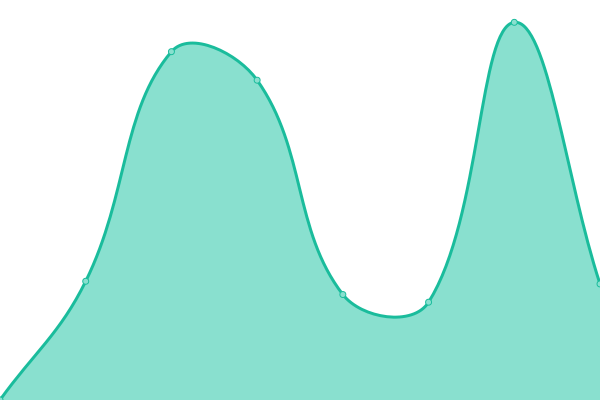
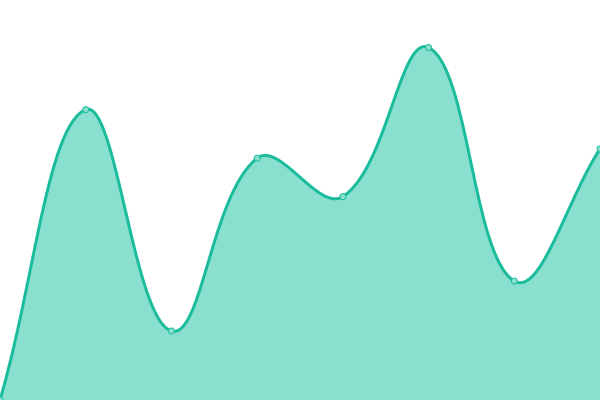

# [📈 Live Status](https://demo.upptime.js.org): <!--live status--> **🟥 Complete outage**

This repository contains the open-source uptime monitor and status page for [tandatanya](https://demo.upptime.js.org), powered by [Upptime](https://github.com/upptime/upptime).

With [Upptime](https://upptime.js.org), you can get your own unlimited and free uptime monitor and status page, powered entirely by a GitHub repository. We use [Issues](https://github.com/tandatanya/upptime/issues) as incident reports, [Actions](https://github.com/tandatanya/upptime/actions) as uptime monitors, and [Pages](https://demo.upptime.js.org) for the status page.

<!--start: status pages-->
<!-- This summary is generated by Upptime (https://github.com/upptime/upptime) -->
<!-- Do not edit this manually, your changes will be overwritten -->
<!-- prettier-ignore -->
| URL | Status | History | Response Time | Uptime |
| --- | ------ | ------- | ------------- | ------ |
|  [Test Down](https://mail.surat.boyolali.go.id/accounts/login/?next=/) | 🟥 Down | [test-down.yml](https://github.com/tandatanya/upptime/commits/HEAD/history/test-down.yml) | 

 0ms
     
 | 

<a href="https://tandatanya.github.io/upptime/history/test-down">0.00%</a>
    

|  [LPSE Boyolali (Eproc4)](https://lpse.boyolali.go.id/eproc4) | 🟥 Down | [lpse-boyolali-eproc4.yml](https://github.com/tandatanya/upptime/commits/HEAD/history/lpse-boyolali-eproc4.yml) | 

 1852ms
     
 | 

<a href="https://tandatanya.github.io/upptime/history/lpse-boyolali-eproc4">0.00%</a>
    

|  [Mail Boyolali](https://mail.boyolali.go.id) | 🟥 Down | [mail-boyolali.yml](https://github.com/tandatanya/upptime/commits/HEAD/history/mail-boyolali.yml) | 

 0ms
     
 | 

<a href="https://tandatanya.github.io/upptime/history/mail-boyolali">0.00%</a>
    

|  [Main Web](https://boyolali.go.id) | 🟥 Down | [main-web.yml](https://github.com/tandatanya/upptime/commits/HEAD/history/main-web.yml) | 

 0ms
     
 | 

<a href="https://tandatanya.github.io/upptime/history/main-web">0.00%</a>
    

<!--end: status pages-->

[**Visit our status website →**](https://demo.upptime.js.org)

## 📄 License

- Powered by: [Upptime](https://github.com/upptime/upptime)
- Code: [MIT](./LICENSE) © [tandatanya](https://demo.upptime.js.org)
- Data in the `./history` directory: [Open Database License](https://opendatacommons.org/licenses/odbl/1-0/)
